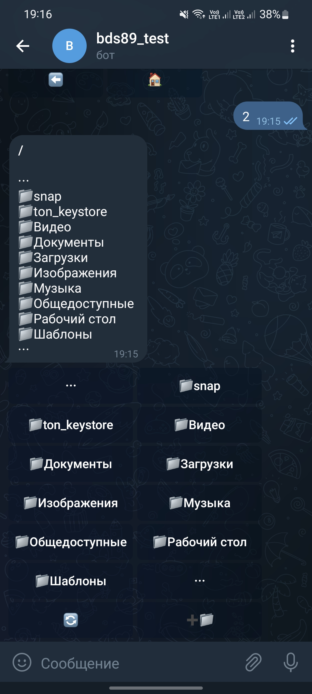

# Telegram resources share 

Access to your resources through telegram bot. Ability to download a file, upload a file, create a folder. Linux and Windows support.
Set up 'config.yaml' run the script (on Windows the script runs in silent mode), start a dialogue with the bot with the command '/start'

<!--  -->
